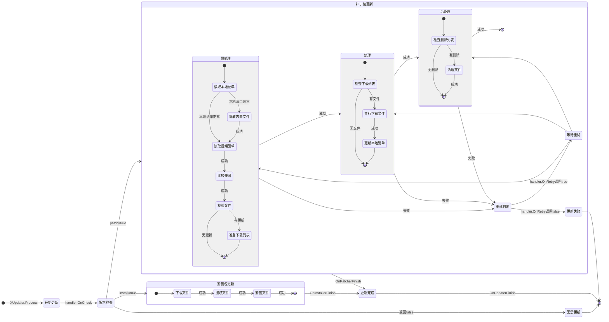

# XUpdater

[](https://www.npmjs.com/package/io.eframework.unity.updater)
[](https://openupm.com/packages/io.eframework.unity.updater)
[](https://deepwiki.com/eframework-io/Unity.Updater)
[](https://discord.gg/XMPx2wXSz3)

XUpdater 提供了更新流程控制和事件通知，实现了可扩展的业务处理接口。

## 功能特性

- 流程控制：支持业务处理接口，提供版本检查和重试策略
- 事件通知：覆盖更新全流程的事件回调，支持进度监控

## 使用手册

### 1. 实现业务处理

更新流程需要提供业务处理器，该处理器实现自 `XUpdater.IHandler` 接口：

```csharp
public class MyHandler : XUpdater.IHandler
{
    private XInstaller installer;
    private List<XPatcher> patchers = new List<XPatcher>();
    
    // Installer 获取安装包更新处理器。
    public XInstaller Installer => installer;
    
    // Patchers 获取补丁包更新处理器列表。
    public List<XPatcher> Patchers => patchers;
    
    // OnCheck 检查更新的状态。
    public bool OnCheck(out bool install, out bool patch)
    {
        // 实现检查逻辑，例如：
        install = false;  // 是否进行安装包更新
        patch = true;    // 是否进行补丁包更新
        
        // 如果需要更新补丁包，初始化补丁包处理器
        if (patch)
        {
            var patcher = new XPatcher(
                "StreamingAssets/Patch.zip",  // 内置地址
                "Local/Patch/Manifest.db",              // 本地地址
                "https://example.com/Patch/Manifest.db"  // 远端地址
            );
            patches.Add(patcher);
        }
        
        return install || patch;  // 返回是否需要更新
    }
    
    // 处理重试逻辑
    public bool OnRetry(XUpdater.Phase phase, XUpdater.IWorker worker, int count, out float pending)
    {
        // 实现重试逻辑，例如：
        pending = 1.0f;  // 重试等待时间（秒）
        return count < 3;  // 最多重试 3 次
    }
}
```

### 2. 执行更新流程

在游戏启动或需要更新的地方，调用 `XUpdater.Process` 方法执行更新流程：

```csharp
// 创建流程处理器
var handler = new MyHandler();

// 执行更新流程
yield return XUpdater.Process(handler);

// 更新完成后的处理
if (string.IsNullOrEmpty(handler.Patches[0].Error))
{
    Debug.Log("更新成功，可以继续游戏流程");
}
else
{
    Debug.LogError($"更新失败：{handler.Patches[0].Error}");
}
```

更新流程的状态转换如下图所示：



### 3. 监听更新事件

可以通过 `XUpdater.Event` 注册事件监听器，获取更新进度和状态：

```csharp
// 注册事件监听器
XUpdater.Event.Register(XUpdater.EventType.OnUpdaterStart, OnUpdaterStart);
XUpdater.Event.Register(XUpdater.EventType.OnPatcherDownloadProgress, OnPatcherDownloadProgress);
XUpdater.Event.Register(XUpdater.EventType.OnUpdaterFinish, OnUpdaterFinish);

// 更新开始事件处理
private void OnUpdaterStart(object sender)
{
    Debug.Log("更新开始");
}

// 补丁下载进度事件处理
private void OnPatcherDownloadProgress(object sender)
{
    var patcher = sender as XPatcher;
    var progress = patcher.Progress(XPatcher.Phase.Download);
    var speed = patcher.Speed(XPatcher.Phase.Download);
    Debug.Log($"下载进度：{progress:P2}，速度：{speed / 1024} KB/s");
}

// 更新完成事件处理
private void OnUpdaterFinish(object sender)
{
    Debug.Log("更新完成");
}
```

## 常见问题

更多问题，请查阅[问题反馈](../CONTRIBUTING.md#问题反馈)。

## 项目信息

- [更新记录](../CHANGELOG.md)
- [贡献指南](../CONTRIBUTING.md)
- [许可协议](../LICENSE.md)